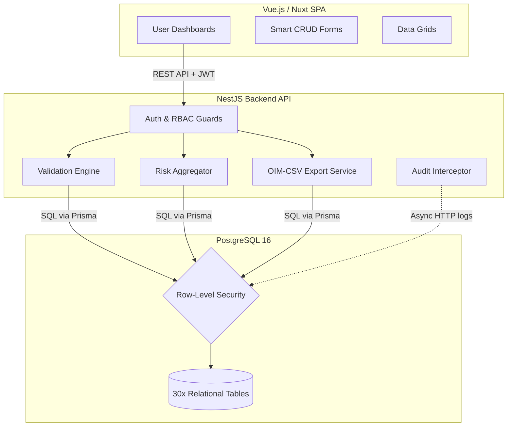
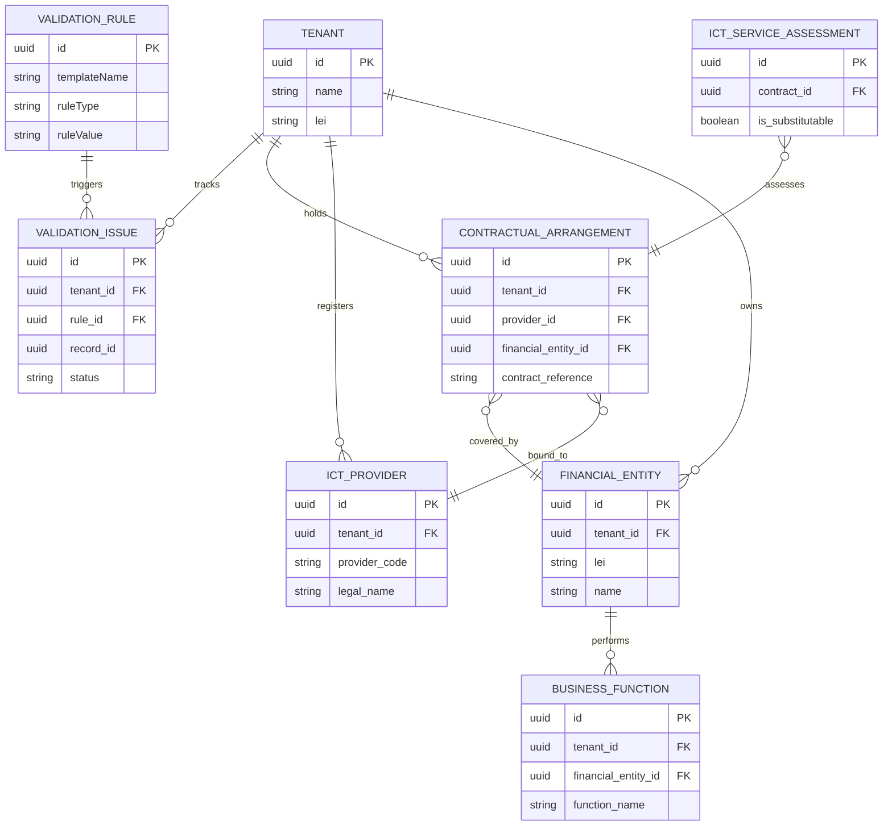

# DORA SaaS — Architecture & Entity-Relationship Diagram

**Version**: 5.0  

---

## The Abstract EBA Data Model vs. The Physical SaaS Architecture

The database architecture of this platform is strictly derived from the official EBA **"Data Model for DORA RoI.pdf"** (the conceptual template). The platform translates this abstract conceptual model into a normalised, 30-table physical PostgreSQL schema. 

However, passing an academic proof-of-concept into a production-ready system requires adapting the structural logic for a cloud environment. Therefore, the EBA model was explicitly extended with "SaaS-specific architectural layers":
1. **Tenant Isolation Layer (Multi-Tenancy)**: The injection of a `tenant_id` foreign key onto every operational table, bound to PostgreSQL Row-Level Security (RLS) to ensure absolute compartmentalisation between disparate financial entities using the platform.
2. **Compliance State-Machine Layer**: The addition of `validation_rules`, `validation_runs`, and `validation_issues` tables to transition the application from a "static data store" into a dynamic, rule-evaluating workflow engine.
3. **Traceability Layer**: The injection of global `audit_logs` and `notifications` to fulfill the immutable tracking mandates of DORA Art. 25.

---

## 1. High-Level Architecture Boundary

The platform is designed as a decoupled, API-first microservices architecture running natively in Docker containers.

### Explanation of the Architecture Boundary and Workflow
The system strictly adheres to a decoupled, API-first microservices boundary. The workflow begins at the **Vue.js/Nuxt Frontend**, which acts solely as a presentation layer holding zero compliance logic. When a user authenticates via the frontend, the NestJS Backend’s **Auth Module** assesses their credentials, issuing a cryptographically signed, short-lived JWT paired with a rotated refresh token.
Every subsequent request from the frontend carries this JWT to the **NestJS Backend Boundary**. Before hitting any business logic, requests are intercepted by global guards: the **RBAC Guard** verifies the user's role permission (Admin vs. Analyst vs. Editor), and the **TenantIsolationMiddleware** extracts their specific `tenant_id`, setting it as a PostgreSQL session variable.
From there, the request routes to specialised micro-engines. If an Analyst triggers validation, the **Validation Engine** reads the live EBA rule definitions and executes dynamic SQL queries against the data. If an Admin initiates an export, the **XBRL OIM-CSV Extractor** compiles the data into the CBI-mandated format. Critically, all backend engines execute their queries through the **Prisma ORM** into **PostgreSQL 16**. Because of the active session variable, the PostgreSQL **Row-Level Security (RLS)** layer intercepts every physical disk read/write at the kernel level, physically blocking any query attempting to cross the strictly enforced multi-tenant boundary. Simultaneously, the **Audit Interceptor** silently captures the payload delta, asynchronously logging the change to ensure total repudiation defense.

---

## 2. Core Entity-Relationship Diagram (ERD)

The database maps directly to the EBA ITS specifications. This diagram illustrates the critical paths of the 30-table schema.

### Description of the Core Relationships
The Entity-Relationship Diagram above outlines the fundamental vectors mapped from the EBA's conceptual design to our physical database:

1. **Tenant to Domain Entities (`1:N`)**: The `TENANT` acts as the absolute boundary wrapper. A single tenant registers and owns multiple `FINANCIAL_ENTITY` records and `ICT_PROVIDER` records within its isolated workspace.
2. **Financial Entities and Contracts (`1:N` / `N:1`)**: A `FINANCIAL_ENTITY` can hold multiple `CONTRACTUAL_ARRANGEMENT`s. Conversely, multiple contracts can be bound to the exact same `ICT_PROVIDER`. This normalisation prevents redundant data entry for shared providers like AWS or Microsoft.
3. **Contracts to Assessments (`1:N`)**: A `CONTRACTUAL_ARRANGEMENT` represents the legal paper, whereas an `ICT_SERVICE_ASSESSMENT` (and its related `EXIT_STRATEGY`) represent the actual operational review of the service. One contract can cover multiple distinct services, thus generating multiple discrete assessments.
4. **Validation Rules to Issues (`1:N`)**: The `VALIDATION_RULE` table holds the 220 official EBA configurations. When the engine runs, if a contract or entity breaks a rule, it generates a `VALIDATION_ISSUE`. The issue links the `tenant_id`, the specific `rule_id`, and the exact `record_id` of the broken entity, holding a 5-state lifecycle (OPEN to RESOLVED) until the data is fixed.

### Note on Extensibility
By utilising lookup tables for standard classifications (e.g. `countries`, `currencies`, `criticality_levels`, `data_sensitivity_levels` defined by the EBA), the system restricts user free-text entry, directly eliminating formatting errors entirely before the Validation Engine even runs.
