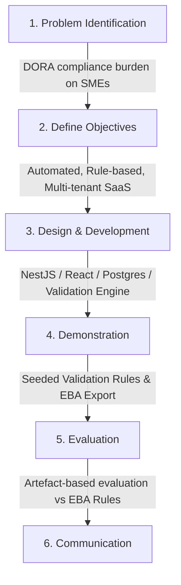
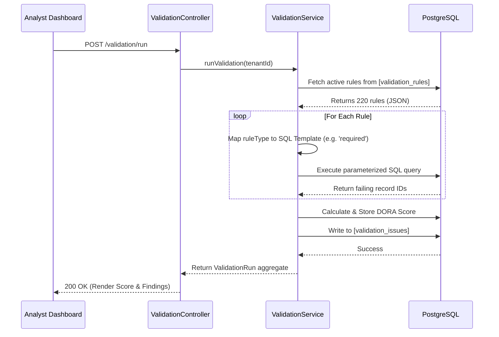
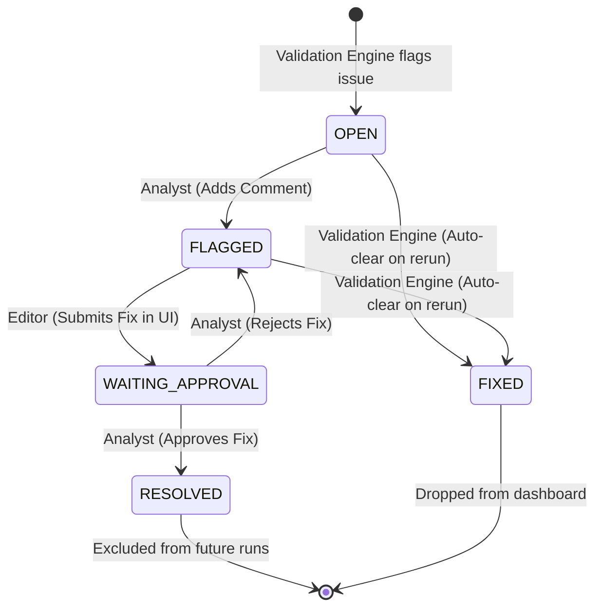
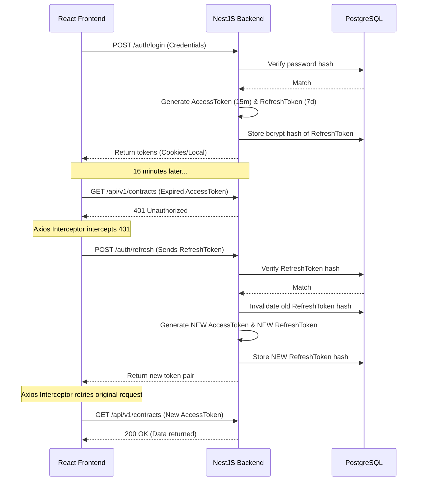
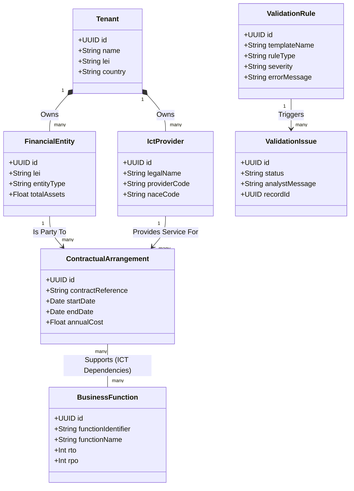
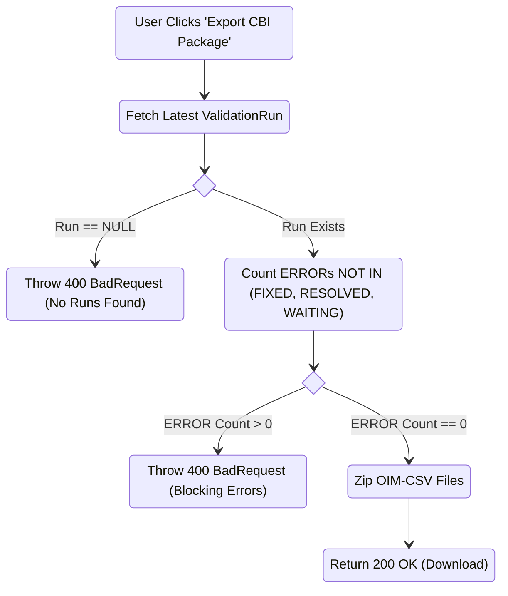

# Dissertation Methodology & Architecture Diagrams

This document contains **Mermaid.js** diagrams representing the exact structures you need for your dissertation. You can screenshot these directly if your Markdown viewer (like GitHub or VSCode) supports Mermaid, or you can copy the code blocks into [Mermaid Live Editor](https://mermaid.live/) to export pristine, high-resolution PNG/SVG files for your Word/LaTeX document.

## 1. DSR Methodology Process (Peffers et al. Model)
**Where to use:** Chapter 3 (Methodology).
**Why you need it:** Proves you followed a formal academic Design Science Research framework.



## 2. High-Level System Architecture (C4 Container Style)
**Where to use:** Chapter 4 (System Architecture).
**Why you need it:** A standard view of the 3-tier architecture and security boundary.

```mermaid
flowchart LR
    subgraph Users
        U1[Analyst]
        U2[Editor]
        U3[Admin]
    end

    subgraph Frontend Tier
        SPA[React SPA\nVite + Tailwind]
    end

    subgraph Application Tier (NestJS)
        Auth[Auth Module\nJWT + Refresh]
        VAL[Validation Engine]
        EXP[RoI Export Module\nExcel + JSON]
        CRUD[Domain Modules\nContracts, Entities, etc.]
    end

    subgraph Data Tier (PostgreSQL)
        DB[(DORA_DB\nPrisma + DB-Level RLS)]
    end
    
    CBI[Central Bank of Ireland\nXBRL OIM-CSV]

    Users -->|HTTPS / REST| SPA
    SPA -->|API Requests| Auth
    SPA -->|API Requests| VAL
    SPA -->|API Requests| EXP
    SPA -->|API Requests| CRUD
    
    Auth <-->|Read / Write| DB
    VAL <-->|SQL Rule Execution| DB
    EXP <-->|Aggregate| DB
    CRUD <-->|Mutate| DB
    
    EXP -->|Download ZIP| CBI
```

## 3. The Validation Engine Sequence Diagram
**Where to use:** Chapter 4 or 5 (Validation Engine deep-dive).
**Why you need it:** Proves the system is a declarative "Rule Engine" not just hardcoded if-statements.



## 4. Issue Lifecycle State Machine
**Where to use:** Chapter 4 (Workflow Design) or Demonstration chapter.
**Why you need it:** Formalizes the remediation workflow mapping the roles (Analyst vs Editor).



## 5. Token Rotation & Session Security Workflow
**Where to use:** Chapter 4 (Security Architecture section).
**Why you need it:** Proves you implemented robust security beyond basic JWTs.



## 6. UML Use Case Diagram (Role-Based Access Control)
**Where to use:** Chapter 4 (Access Control & Authorisation).
**Why you need it:** Proves the application enforces strict boundaries between different user personas as mandated by the Peffers DSR objectives for security.

```mermaid
usecaseDiagram
    actor Admin
    actor Analyst
    actor Editor

    package "DORA SaaS Platform" {
        usecase "Manage Tenants & Users" as UC1
        usecase "Export CBI Validation package" as UC2
        usecase "View Concentration Risk Dashboard" as UC3
        
        usecase "Execute Validation Run" as UC4
        usecase "Flag Compliance Issues" as UC5
        usecase "Approve/Reject Fixes" as UC6
        usecase "Manage ICT Supply Chain" as UC7
        
        usecase "Manage Contracts & ICT Providers" as UC8
        usecase "Resolve Compliance Issues" as UC9
    }

    Admin --> UC1
    Admin --> UC2
    Admin --> UC3
    
    Analyst --> UC4
    Analyst --> UC5
    Analyst --> UC6
    Analyst --> UC7
    
    Editor --> UC8
    Editor --> UC9
    
    %% Note: Admin inherently has read access to everything, but this maps write/execution duties.
```

## 7. UML Class Diagram (Core Domain Model)
**Where to use:** Chapter 4 (Database Architecture).
**Why you need it:** An object-oriented perspective of your relational database. Essential for examiners to map the DORA regulatory articles (contracts, providers, functions) to your system entity objects (Classes).



## 8. UML Activity Diagram (RoI Export Pre-Flight Gate)
**Where to use:** Chapter 5 (Implementation / Evaluation).
**Why you need it:** Visually proves that your system programmatically blocks non-compliant Excel/XBRL generation based on live validation logic.



---

## Omitted UML Diagrams (And How to Defend Them)

If an examiner or reviewer asks why certain traditional UML diagrams are not present in your thesis, you should explicitly state the following rationale in your Methodology or Limitations chapter:

1. **UML Deployment Diagram**: 
   * **Why it is omitted**: The current artefact is explicitly framed as a mathematically complete *proof-of-concept prototype* running via local `docker-compose`. 
   * **Defense**: "A formal Deployment Diagram mapping cloud topology, load balancers, and highly available multi-AZ Postgres replicas was deemed out-of-scope for the Design Science Research cycle. The primary research objective was validating the rule-engine architecture and data modeling, not cloud orchestration."
2. **UML Object Diagram**: 
   * **Why it is omitted**: Object diagrams represent instances of classes at specific moments in time. 
   * **Defense**: "Given the massive scale of the seeded database (hundreds of mock entities, providers, and contracts), modeling instance-level discrete objects provided no additional academic value over the structural Class Diagram."
